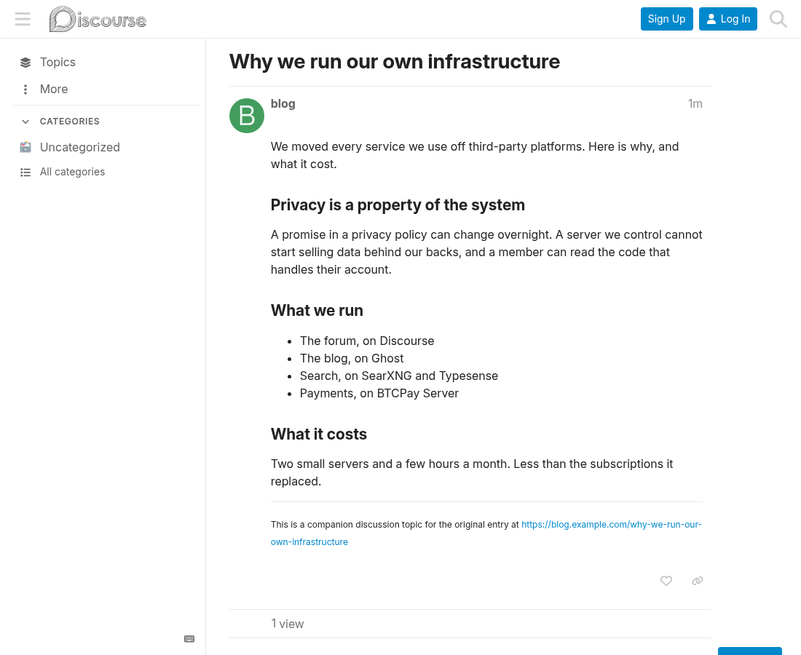

# Full embedded posts

[ENGLISH](README.md) | **ESPAÑOL**

Mantenido por Criptonautas. Sin afiliación ni respaldo de Discourse (Civilized Discourse Construction Kit, Inc.).

Componente de tema de Discourse. Los temas creados por la función de
[Embedding](https://meta.discourse.org/t/embedding-discourse-comments-via-javascript/31963)
muestran el artículo completo al cargar, en lugar de un extracto más un botón "Mostrar más".

## Instalación

Admin → Personalizar → Temas → Componentes → Instalar → Desde un repositorio git, con la URL de este repo.

## Notas

El truncado ocurre en la importación: el extracto se convierte en el post y el artículo completo
se guarda en `topic_embeds.embed_content_cache`. El componente lo obtiene por el mismo endpoint
`/posts/:id/expand-embed` que usa el botón, con caché en el servidor, así que tu blog no se
vuelve a rastrear. Si esa petición falla, el botón se deja en su lugar.

Desactivar el ajuste del sitio `embed truncate` solo afecta a las importaciones *futuras*; esos
temas no son expandibles y el componente no hace nada con ellos. Los temas ya importados
conservan el extracto en la base de datos hasta que se reimporten con `TopicEmbed.import` desde
la consola de rails; mientras tanto, este componente es lo que hace que se muestren completos.

## Licencia

MIT. Consulta [LICENSE](LICENSE).

Texto de este README bajo [CC BY-NC-SA 4.0](CC-BY-NC-SA-4.0.txt).
